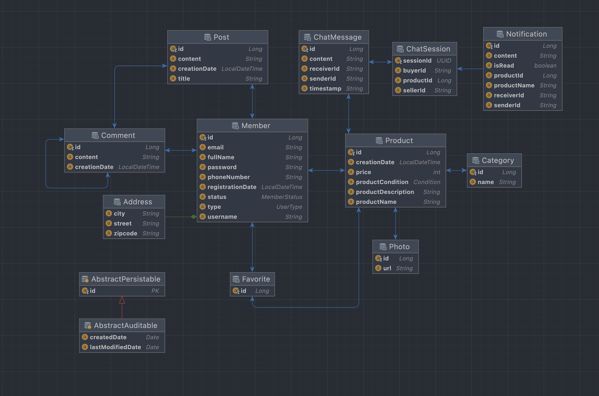
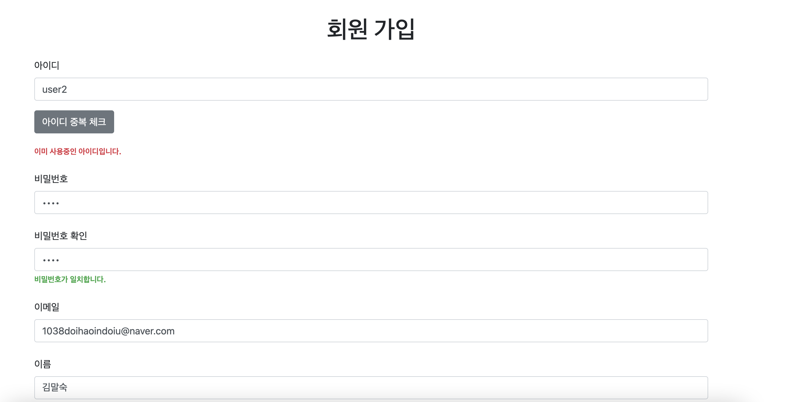
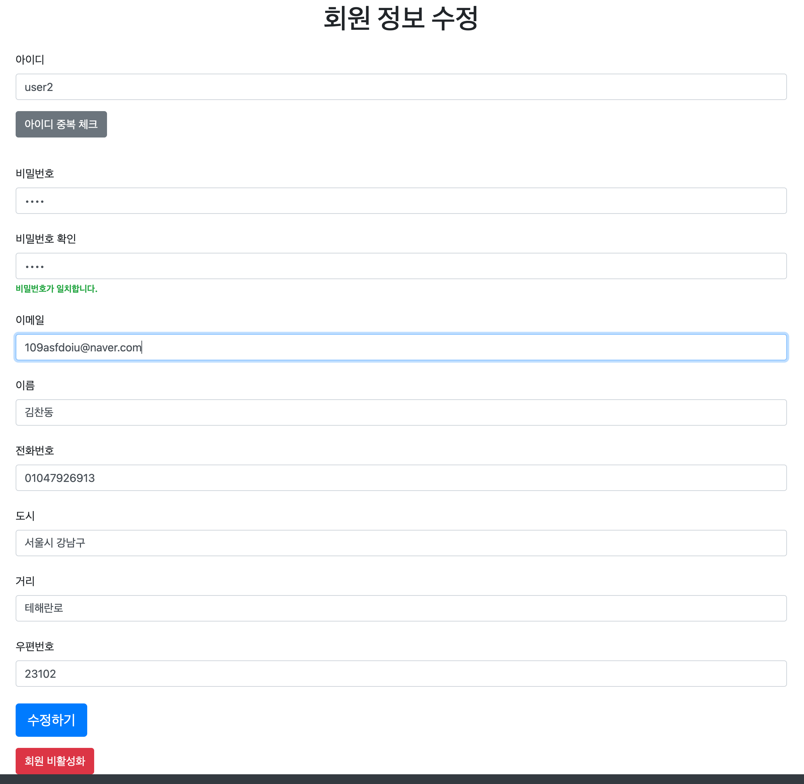
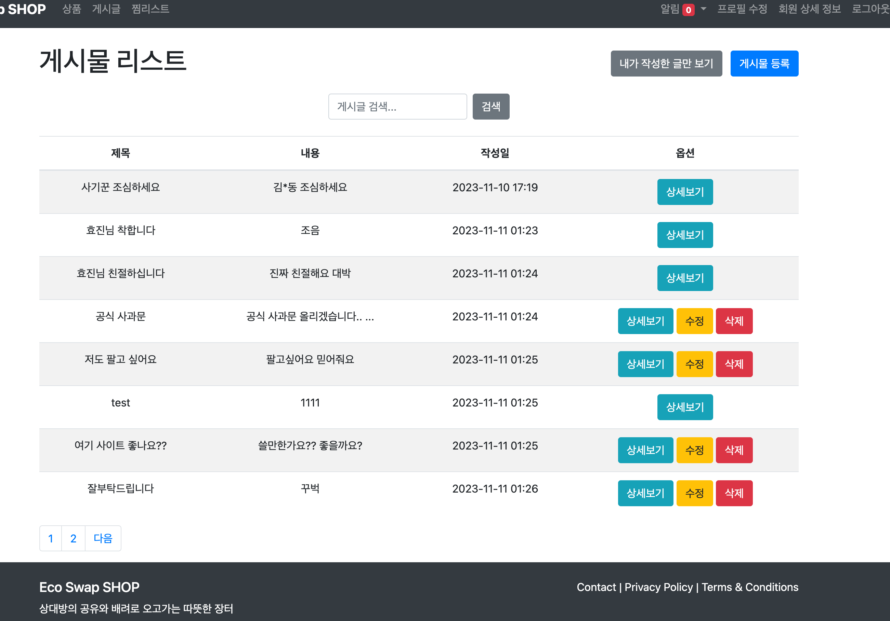
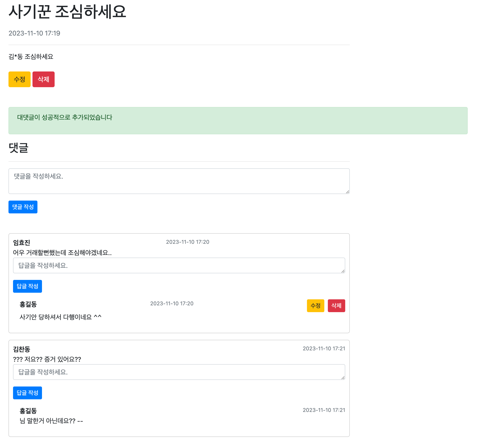
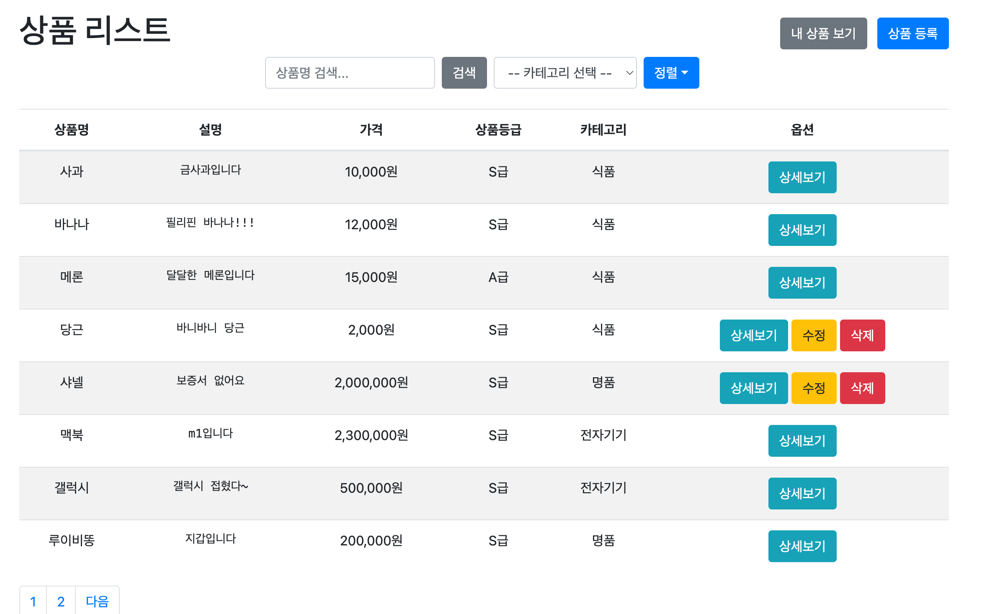
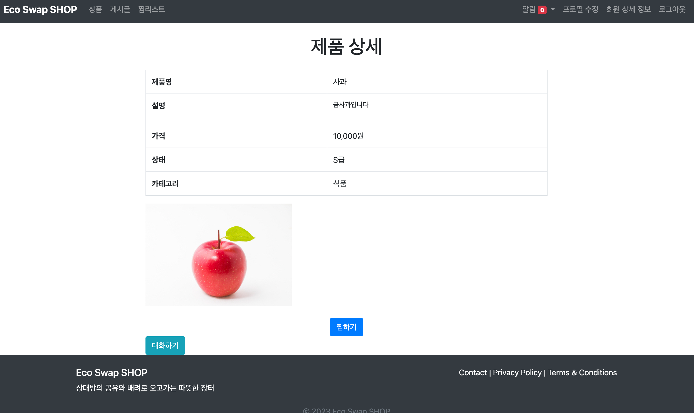
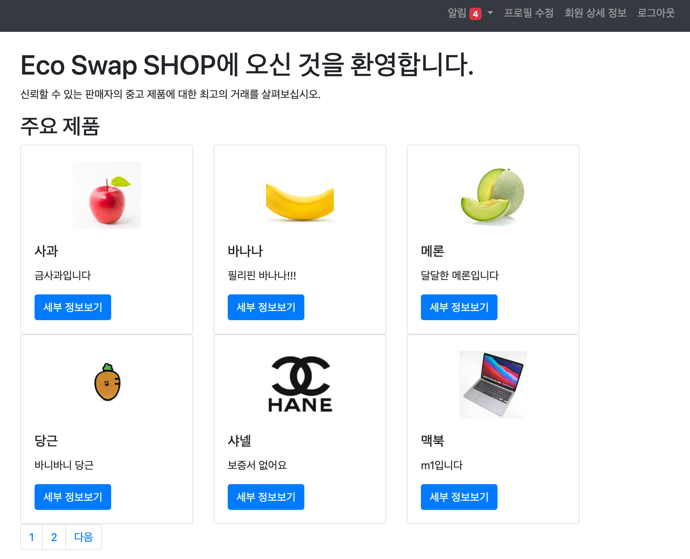
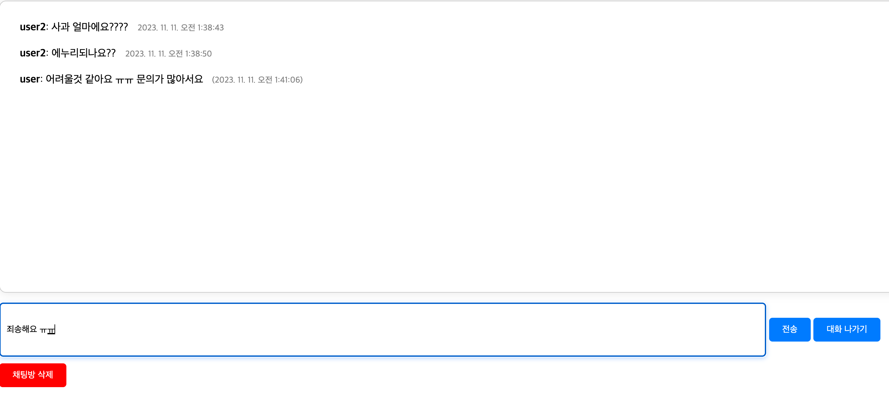

# Eco Swap Shop: 중고거래 플랫폼
  환경을 생각하는 Eco Swap Shop에 오신 것을 환영합니다! 여기서는 개인화된 경험을 제공하는 사용자 중심의 플랫폼을 통해 지속 가능한 소비를 촉진합니다.
***
# 프로젝트 소개
EcoSwapShop은 중고 물품 거래를 위한 웹사이트로, 사용자들이 효율적으로 물품을 사고팔 수 있는 플랫폼을 제공합니다. \
이 프로젝트는 지속 가능한 소비를 장려하고 환경에 미치는 영향을 줄이기 위해 시작되었습니다. \
Spring boot 를 사용하여 REST API를 설계 및 구축 Thymeleaf와 연동하여 사용자 친화적인 중고거래 웹 사이트를 제공합니다.
***
# 주요 기능

- 사용자 계정 관리: 등록, 로그인, 프로필 관리 등의 기능을 포함한 계정 관리 시스템을 구현했습니다.
- 상품 관리: 사용자가 상품을 등록, 수정, 조회할 수 있는 기능을 개발했습니다.
- 상호작용 기능: 댓글, 답글, 실시간 채팅, 찜하기 기능을 통해 사용자 간 상호작용을 가능하게 했습니다.
- 보안 기능: 비밀번호 암호화와 이메일 기반의 비밀번호 복구 서비스를 통해 사용자의 데이터를 보호했습니다.
- 알림 시스템: 사용자 설정에 따라 맞춤형 메시지 알림을 제공합니다.
- 콘텐츠 관리: 게시글의 등록, 관리 및 카테고리별 분류를 지원합니다.
- 검색 및 필터링: 사용자가 원하는 상품을 쉽게 찾을 수 있도록 검색 및 필터 기능을 구현했습니다.

***
# 기술 스택
## 백엔드
- Java 17: 최신 기능과 성능 개선을 제공하는 프로그래밍 언어.
- Spring Boot 2.5.4: 애플리케이션 개발을 빠르고 쉽게 만들어주는 프레임워크.
- Spring Data JPA: 데이터 접근 계층을 쉽게 구현하기 위한 모듈.
- Spring Security: 인증과 권한 부여를 위한 보안 프레임워크.
- Spring WepSockets: 양방향 통신을 위한 WebSocket 지원.
- Spring Boot Mail: 메일 발송 기능을 제공.
- Hibernate: 객체 관계 매핑(ORM)을 위한 프레임워크.
- P6Spy: SQL 문을 로깅하기 위한 라이브러리.
- H2 Database: 인메모리 데이터베이스.
## 보안 및 암호화
- BCrypt: 비밀번호 해싱을 위한 암호화 알고리즘.
## 데이터 모델링:
- Lombok: 자바 코드 단순화를 위한 라이브러리. 보일러플레이트 코드를 줄여줍니다.
## 프론트엔드
- HTML/CSS: 웹 페이지의 구조와 스타일을 정의.
- Thymeleaf: 서버 사이드 자바 템플릿 엔진.
- JavaScript/Ajax: 클라이언트 사이드 스크립트와 비동기 웹 페이지 업데이트.
- SockJS: 브라우저 간 호환성을 제공하는 WebSocket의 대체제.
## 통신 프로토콜
- STOMP: 메시징 프로토콜.
## 테스팅
- JUnit: 자바 애플리케이션을 위한 유닛 테스팅 프레임워크.
## API 개발
- REST API: 웹 서비스를 위한 API 아키텍처 스타일.
***
# Entity Relationship Diagram

***
# Class Diagram

***
# 구현
## 보안 및 인증
- Spring Security와 통합하여 CSRF 보호를 제공, 사용자 인증 및 인가
- CSRF Token을 사용한 인증 시스템

## 데이터 처리
- 각 Repository 인터페이스는 JpaRepository를 상속받아, CRUD 연산을 위한 기본적인 메서드를 자동으로 제공
- Spring Data JPA 와 H2 DB를 사용하여 데이터를 저장하고 처리
- Repository 사용하여 비즈니스 로직을 처리하는 Service 계층을 구현
- Pageable 인터페이스를 파라미터로 받는 메서드를 통해 페이징과 정렬 기능을 쉽게 구현
- UUID를 키로 사용하여 채팅 세션을 관리

## Thymeleaf로 프론트엔드 개발
- Bootstrap CSS 프레임워크를 사용하여 스타일링을 적용
- SockJS와 Stomp.js를 활용해 백엔드 서버와의 웹소켓 연결을 설정.(실시간 채팅)
- Spring Security와의 통합을 통해 CSRF 토큰 관리와 같은 보안 기능을 손쉽게 구현
- $.ajax 함수를 사용하여 서버에 비동기적으로 HTTP 요청, 사용자의 입력에 대한 피드백을 제공
- 메타 태그 viewport를 사용하여 모바일 및 다양한 화면 크기에 대응하는 반응형 웹 디자인을 적용

## 배포 및 CI/CD
- GitHub 저장소로 코드를 관리하고, GitHub Actions를 사용하여 Java 애플리케이션에 대한 CI/CD 파이프라인을 구축
- 이를 통해 master 브랜치에 코드가 푸시되거나 master 브랜치로 pull request가 생성될 때 자동으로 테스트 및 배포
***
# 주요 기능
## 홈
***

- 개인화된 환경: 사용자 로그인 시 개인화된 헤더 제공, 메시지 알림, 프로필 수정, 상세 회원 정보 접근.
- 최신 상품 노출: 홈 화면에는 최근 등록된 상품 6개를 동적으로 표시.

## 회원가입 및 계정 관리
***

- 간편한 회원가입: 필수 정보 입력을 통한 빠른 가입 프로세스와 아이디 중복 확인 기능.
- 비밀번호 확인: 비밀번호의 정확성을 검증하여 계정 보안 강화.
- 프로필 수정: 비밀번호 확인 후 사용자 정보 수정 가능.
- 회원 비활성화: 사용자 주도의 계정 비활성화 옵션 및 자동 탈퇴 시스템.

## 게시판 및 상호작용
***

- 커뮤니티 게시판: 사용자가 게시한 글 관리(수정, 삭제)와 검색 기능.
- 개인 글 필터링: 자신이 작성한 글만 볼 수 있는 기능.
- 댓글 및 대댓글: 게시글에 대한 댓글과 대댓글 시스템으로 소통 강화.
- 사용자 권한 확인: 수정 및 삭제는 글 작성자에게만 허용.

## 상품 등록 및 관리
***

- 상품 등록: 상품 정보, 사진, 상태, 카테고리 등록을 통한 간편 상품 등록.
- 상품 리스트 및 관리: 사용자 별 상품 관리와 상세 정보 확인, 판매자와의 대화 기능.
- 검색 및 정렬: 상품 검색, 카테고리 및 가격별 정렬, 내 상품 조회 기능.

## 상품 상세 페이지 및 찜 기능
***

- 상세 정보: 상품의 상세 정보 및 설명 확인.
- 찜 리스트: 관심 상품을 찜하여 차후 조회.

## 메시징 및 알림
***

- 실시간 채팅: 사용자 간의 실시간 대화 가능.
- 알림 시스템: 로그인 시 메시지 알림 확인, 읽지 않은 메시지 구분.

## 관리자 기능
***

- 카테고리 관리: ADMIN 권한으로만 접근 가능한 카테고리 관리 기능.

## 추가 기능
***

- 페이징 처리: 사용자 경험을 고려한 페이징 처리.
- 에러 핸들링: 권한 없는 접근 시 사용자 친화적인 에러 페이지 리다이렉션.
