# Eco Swap Shop: 중고거래 플랫폼
  환경을 생각하는 Eco Swap Shop에 오신 것을 환영합니다! 여기서는 개인화된 경험을 제공하는 사용자 중심의 플랫폼을 통해 지속 가능한 소비를 촉진합니다.
***
# 프로젝트 소개
EcoSwapShop은 중고 물품 거래를 위한 웹사이트로, 사용자들이 효율적으로 물품을 사고팔 수 있는 플랫폼을 제공합니다.  
이 프로젝트는 지속 가능한 소비를 장려하고 환경에 미치는 영향을 줄이기 위해 시작되었습니다.  
Spring boot 를 사용하여 REST API를 설계 및 구축 Thymeleaf와 연동하여 사용자 친화적인 중고거래 웹 사이트를 제공합니다.
***
# 주요 기능

- 사용자 계정 관리: 등록, 로그인, 프로필 관리 등의 기능을 포함한 계정 관리 시스템을 구현했습니다.
- 상품 관리: 사용자가 상품을 등록, 수정, 조회할 수 있는 기능을 개발했습니다.
- 상호작용 기능: 댓글, 답글, 실시간 채팅, 찜하기 기능을 통해 사용자 간 상호작용을 가능하게 했습니다.
- 보안 기능: 비밀번호 암호화와 이메일 기반의 비밀번호 복구 서비스를 통해 사용자의 데이터를 보호했습니다.
- 알림 시스템: 사용자 설정에 따라 맞춤형 메시지 알림을 제공합니다.
- 콘텐츠 관리: 게시글의 등록, 관리 및 카테고리별 분류를 지원합니다.
- 검색 및 필터링: 사용자가 원하는 상품을 쉽게 찾을 수 있도록 검색 및 필터 기능을 구현했습니다.

***
# 기술 스택
## 백엔드
- Java 17: 최신 기능과 성능 개선을 제공하는 프로그래밍 언어.
- Spring Boot 2.5.4: 애플리케이션 개발을 빠르고 쉽게 만들어주는 프레임워크.
- Spring Data JPA: 데이터 접근 계층을 쉽게 구현하기 위한 모듈.
- Spring Security: 인증과 권한 부여를 위한 보안 프레임워크.
- Spring WepSockets: 양방향 통신을 위한 WebSocket 지원.
- Spring Boot Mail: 메일 발송 기능을 제공.
- Hibernate: 객체 관계 매핑(ORM)을 위한 프레임워크.
- P6Spy: SQL 문을 로깅하기 위한 라이브러리.
- H2 Database: 인메모리 데이터베이스.
## 보안 및 암호화
- BCrypt: 비밀번호 해싱을 위한 암호화 알고리즘.
## 데이터 모델링:
- Lombok: 자바 코드 단순화를 위한 라이브러리. 보일러플레이트 코드를 줄여줍니다.
## 프론트엔드
- HTML5/CSS: 웹 페이지의 구조와 스타일을 정의.
- Thymeleaf: 서버 사이드 자바 템플릿 엔진.
- JavaScript/Ajax: 클라이언트 사이드 스크립트와 비동기 웹 페이지 업데이트.
- SockJS: 브라우저 간 호환성을 제공하는 WebSocket의 대체제.
## 통신 프로토콜
- STOMP: 메시징 프로토콜.
## 테스팅
- JUnit5: 자바 애플리케이션을 위한 유닛 테스팅 프레임워크.
## API 개발
- REST API: 웹 서비스를 위한 API 아키텍처 스타일.
***
# Entity Relationship Diagram
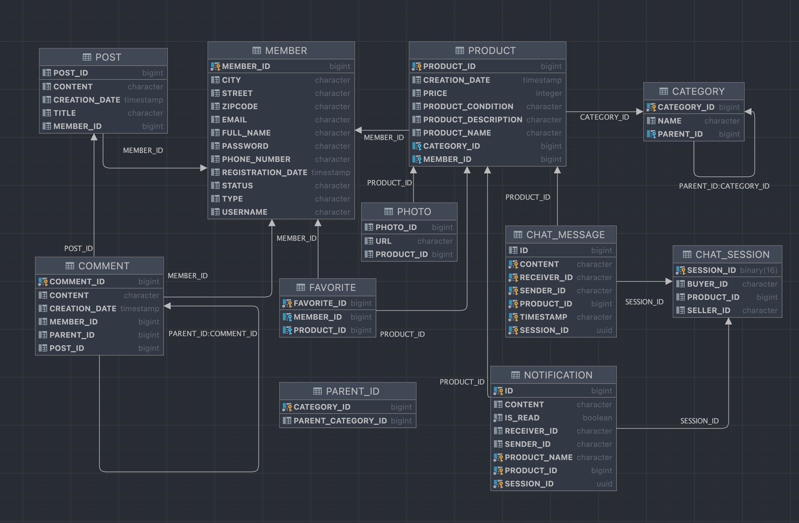
***
# Class Diagram
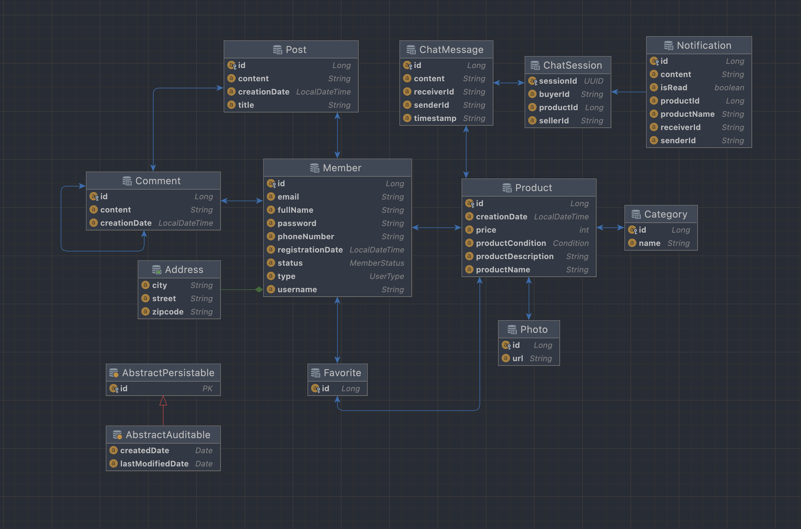
***
# 구현
## 보안 및 인증
- `Spring Security`와 통합하여 `CSRF` 보호를 제공, 사용자 인증 및 인가
- `CSRF Token`을 사용한 인증 시스템

## 데이터 처리 기능 구현
- `Spring Boot`와 `MVC 패턴`을 사용하여 기능을 구현
- `RESTful API` 디자인 구현
- 데이터 유효성 검증
- 각 Repository 인터페이스는 `JpaRepository`를 상속받아, CRUD 연산을 위한 기본적인 메서드를 자동으로 제공
- `Spring Data JPA` 와 H2 DB를 사용하여 데이터를 저장하고 처리
- Repository 사용하여 비즈니스 로직을 처리하는 Service 계층을 구현
- `Pageable` 인터페이스를 파라미터로 받는 메서드를 통해 페이징과 정렬 기능을 쉽게 구현
- `UUID`를 키로 사용하여 채팅 세션을 관리

## Thymeleaf로 프론트엔드 개발
- `Bootstrap` CSS 프레임워크를 사용하여 스타일링을 적용
- `SockJS`와 `Stomp.js`를 활용해 백엔드 서버와의 웹소켓 연결을 설정.(실시간 채팅)
- `Spring Security`와의 통합을 통해 `CSRF` 토큰 관리와 같은 보안 기능을 손쉽게 구현
- `$.ajax` 함수를 사용하여 서버에 비동기적으로 HTTP 요청, 사용자의 입력에 대한 피드백을 제공
- 메타 태그 `viewport`를 사용하여 모바일 및 다양한 화면 크기에 대응하는 반응형 웹 디자인을 적용

## 배포 및 CI/CD
- GitHub 저장소로 코드를 관리하고, GitHub `Actions`를 사용하여 Java 애플리케이션에 대한 CI/CD 파이프라인을 구축
- 이를 통해 `master` 브랜치에 코드가 푸시되거나 `master` 브랜치로 `pull request`가 생성될 때 자동으로 테스트 및 배포
***
# 주요 기능
## 홈페이지
***

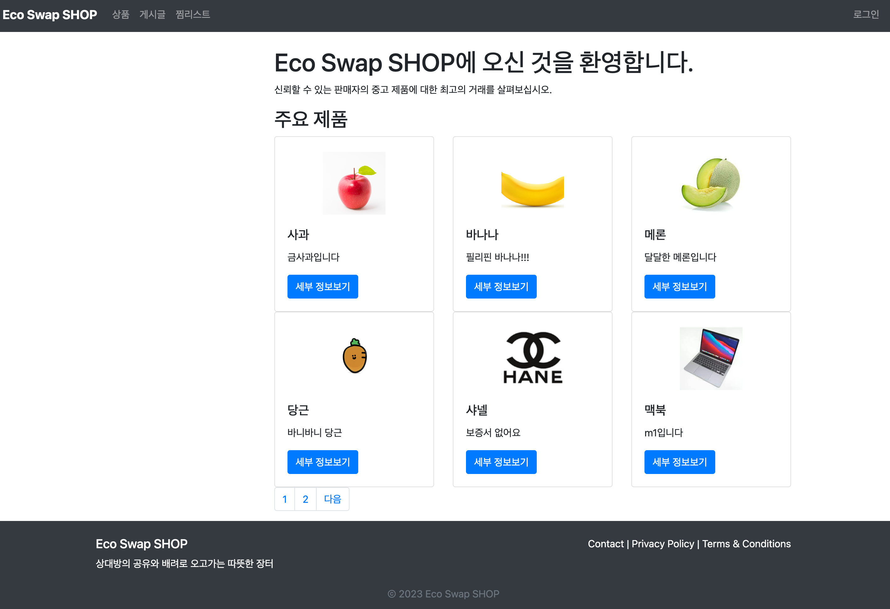

- 개인화된 환경(header, footer): `th:replace`를 사용하여 웹사이트의 헤더와 푸터를 각 페이지에 포함.
- 최신 상품 노출: 제품 리스트는 `th:each`를 사용하여 반복적으로 표시, `Thymeleaf`를 활용하여 페이지네이션 구현을 통해 사용자가 제품 페이지를 넘길 수 있음.  

## 회원가입 및 계정 관리
***
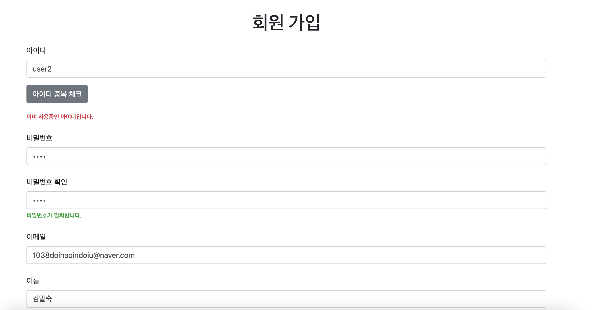
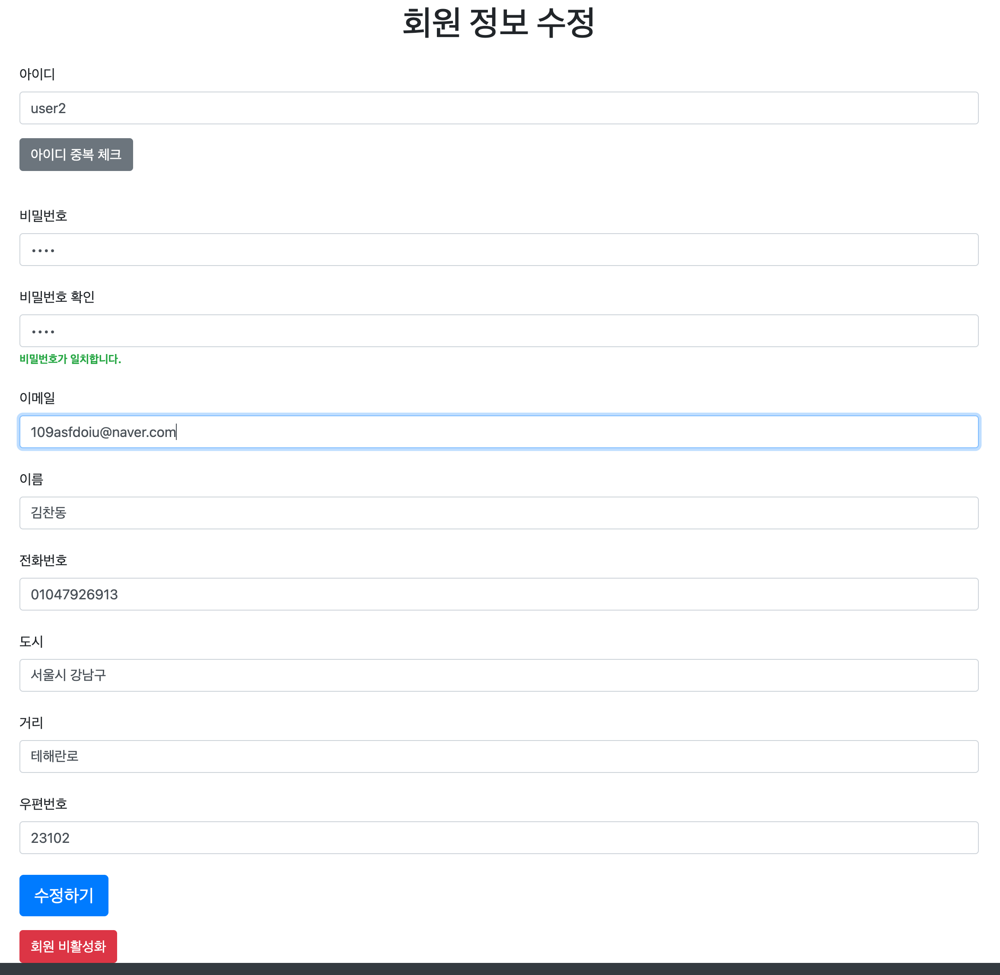
- 회원관리: `Spring Boot`와 `MVC 패턴`을 사용하여 회원 관리 기능을 구현
- 데이터 유효성 검증: 사용자 입력은 `@Valid` 어노테이션을 통해 검증.
- 비밀번호 일치 검사: `JQuery`를 사용하여 `비밀번호`와 `비밀번호 확인` 입력 필드의 값이 일치하는지 실시간으로 검사.
- 회원 정보 수정: `JQuery`를 사용하여 비밀번호 일치 여부를 실시간으로 확인합니다. 또한, `AJAX`를 통해 아이디 중복 여부를 검사.
- 아이디 중복 검사: `아이디 중복 체크` 버튼에 `JQuery`의 `AJAX` 호출을 사용하여 클라이언트 사이드에서 아이디 중복 검사를 수행.
- CSRF 보호: `Thymeleaf`와 `Spring Security`의 통합을 통해 `CSRF` 토큰을 폼에 포함시켜, 보안을 강화.
- 비밀번호 찾기: `Gradle`에 추가하여 `Spring Boot`에서 이메일 서비스를 사용, `application.yml` 파일에서 메일 서버 설정을 통해 이메일 전송 기능을 구성하고,  
  `SSL`을 활성화하여 이메일 전송 시 보안을 강화, 임시 비밀번호 생성 후, `JavaMailSender`를 사용하여 이메일을 구성하고 전송.
- 회원 비활성화: `Spring Security`와 `Thymeleaf`를 통합하여 `CSRF`토큰을 추가,비밀번호 입력 필드에는 `required` 속성을 추가하여,  
사용자가 비밀번호를 입력하지 않으면 폼을 제출할 수 없음.

## 게시판 및 상호작용
***
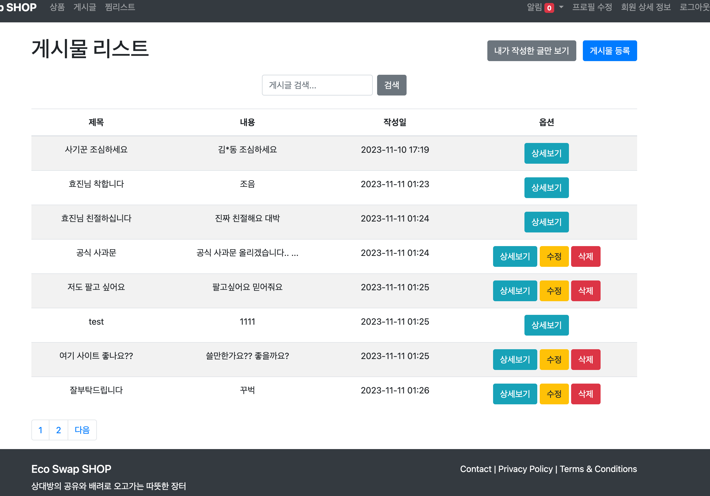
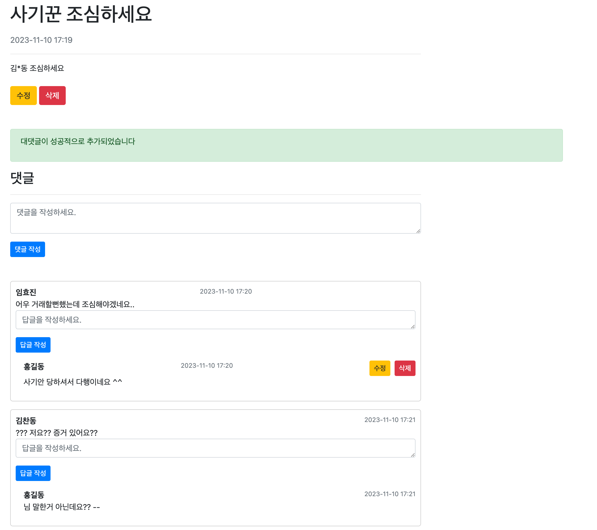
- 커뮤니티 게시판: 각 게시물에 대한 `상세보기`,`수정`,`삭제` 기능을 제공하며, `수정`및`삭제` 버튼은 `Thymeleaf`의 조건문 `th:if`를 사용하여 현재 로그인한 사용자가 게시물의 작성자일 경우에만 표시.
- 댓글 및 대댓글: 댓글 및 대댓글에는 수정 및 삭제 버튼이 포함되어 있으며, 이 기능은 게시물의 소유자 또는 댓글 작성자에게만 표시됨.  
  댓글 및 대댓글의 수정 버튼을 클릭했을 때 수정 폼이 표시(JavaScript 동적 인터페이스).
- 보안 및 사용자 권한 검증: `Tymeleaf` 조건문을 사용하여 수정 및 삭제 버튼의 표시 여부를 결정.
- 게시물 상세보기: `Thymeleaf`를 사용하여 서버에서 받은 게시물 데이터(제목, 내용, 작성일 등)를 동적으로 표시.

## 상품 등록 및 관리
***
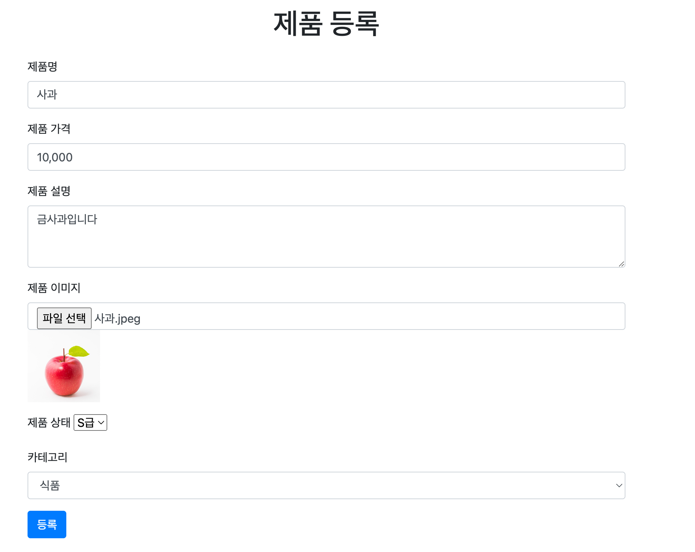
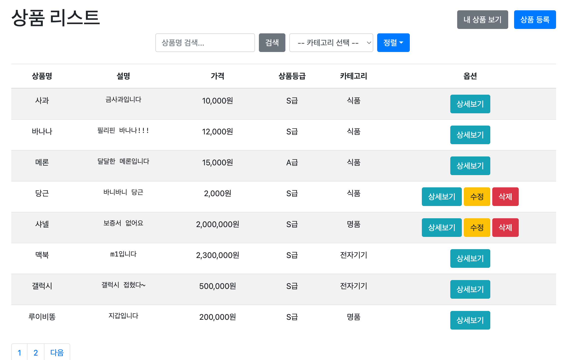
- 제품 등록: 이미지추가에는 `enctype="multipart/form-data` 속성을 사용하여 파일 업로드를 처리.  
  `JavaScript`와 `jQuery`를 사용하여 가격 입력란에서 사용자가 숫자를 입력할 때 콤마(,)를 자동으로 추가하고, 폼 제출 전에 콤마를 제거.  
  `JavaScript`와 `jQuery`를 통해 사용자가 선택한 이미지 파일의 미리보기를 제공.
- 사용자 권한 확인: 로그인한 사용자의 `ID(loggedInMemberId)`를 통해 `수정`, `삭제` 표시 여부를 결정.
- 검색 기능 및 페이지: `Spring Data JPA`로 페이징 및 정렬 기능을 자동으로 처리.

## 상품 상세 페이지 및 찜 기능
***
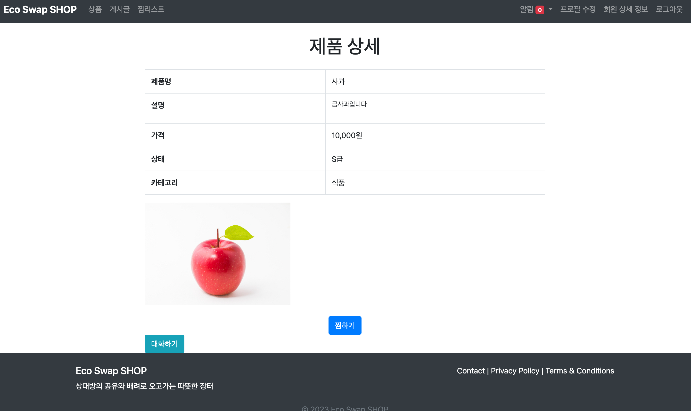

- 상세 정보: `수정`과 `삭제` 버튼은 로그인한 사용자가 제품 등록자일 경우에만 표시.
- 찜 추가/삭제: 사용자가 "찜하기" 버튼을 클릭하면, 해당 상품의 ID와 사용자 ID가 서버로 전송.  
Favorite `인스턴스`가 이미 존재하면 삭제하고, 없으면 새로 생성하여 저장
- 찜 목록 조회: 로그인한 사용자의 ID를 기반으로 찜 목록을 조회.
- 보안 및 권한 관리: 사용자의 로그인 상태와 권한을 확인하여, 찜 목록 조회 및 수정 작업을 안전하게 관리.  
이를 통해 로그인하지 않은 사용자나 다른 사용자의 찜 목록에 접근하려는 시도를 방지.

## 메시징 및 알림
***

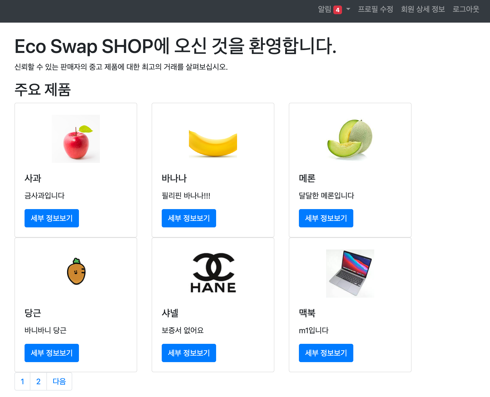
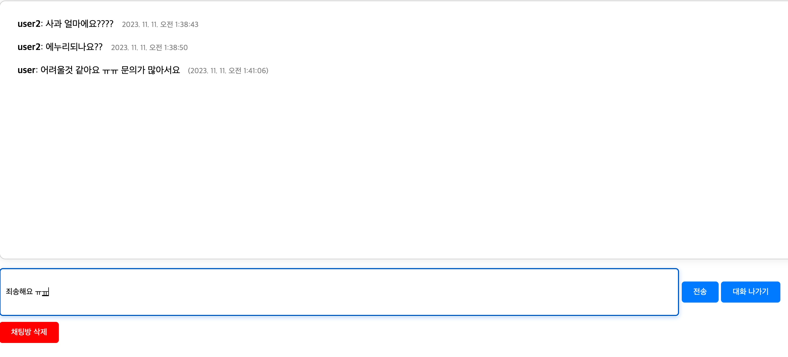
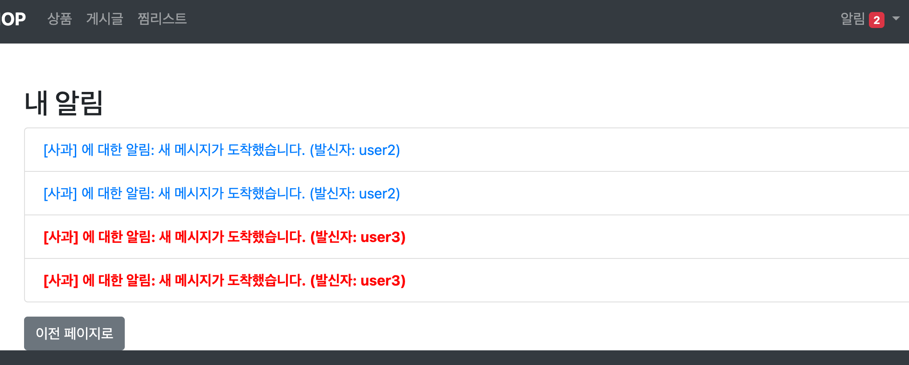
- WebSocket 및 STOMP 설정: `@EnableWebSocketMessageBroker` 어노테이션을 사용하여 `WebSocket` 메시지 브로커를 활성화.  
  `/topic`을 통해 구독을 활성화, `/app`으로 시작하는 메시지를 `@MessageMapping`으로 라우팅.  
  `@MessageMapping`을 사용하여 클라이언트에서 보낸 메시지를 처리, `@SendTo`를 통해 메시지를 특정 주소로 전송.  
  `/ws` 엔드포인트를 설정하여 `WebSocket` 연결을 위한 주소를 제공하고, `SockJS`를 사용하여 폴백 옵션을 제공.  
- CORS 설정: `/ws/**` 경로로의 요청에 대해 CORS 허용.
- 실시간 채팅: `SockJS`와 `Stomp` 라이브러리를 사용하여 웹소켓 기반의 실시간 통신을 구현, `ChatSession`으로 각 채팅방 관리.   
  `th:each`를 사용하여 서버로부터 전달받은 chatHistory을 순회하며 각 메시지를 화면에 표시.  
  `CSRF` 토큰을 저장하며, 이는 서버 요청 시 보안을 강화
- 알림 클릭 이벤트: 사용자가 알림을 클릭하면, `JavaScript`의 `fetch` 함수를 이용해 해당 알림을 읽음 상태로 변경하는 `AJAX` 요청을 서버로 보
## 관리자 기능
***
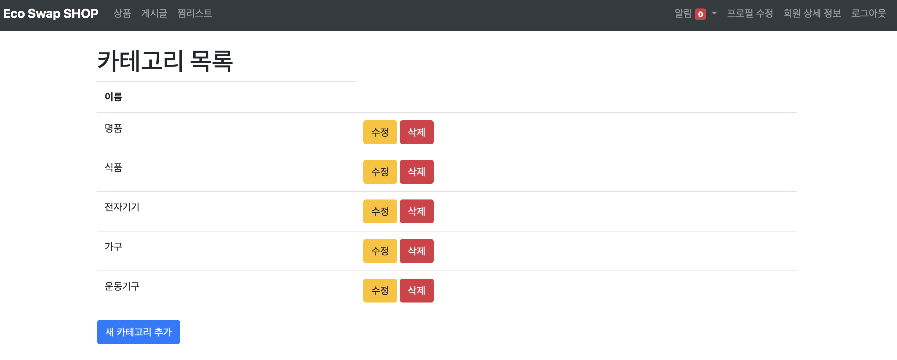
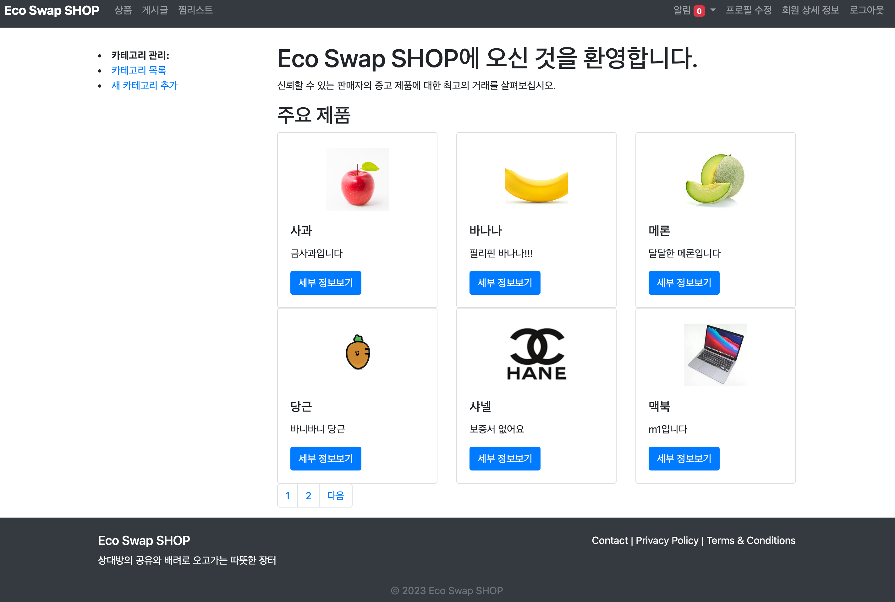
- 카테고리 관리: `Spring Security`를 사용하여 `ROLE_ADMIN`권한을 가진 사용자만 각 카테고리 옆에는 수정 및 삭제 옵션이 제공, 액세스할 수 있도록 제한.

## 추가 기능
***
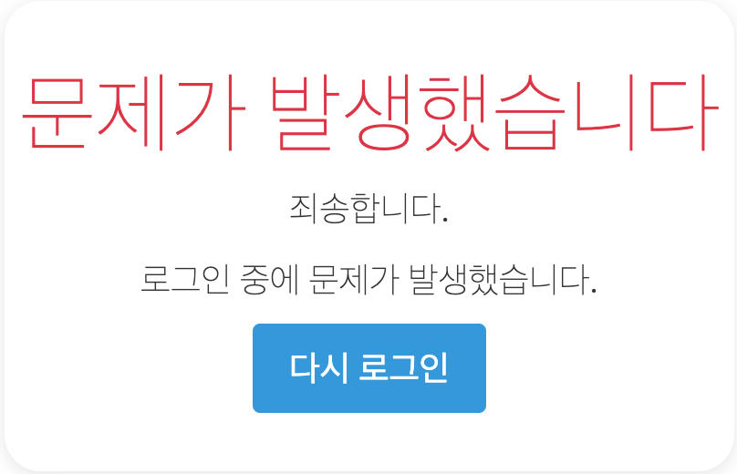
- 에러 핸들링: 권한이 없는 과정에서 발생한 에러를 알려주고, 사용자가 다시 로그인 페이지로 돌아갈 수 있는 옵션을 제공.
